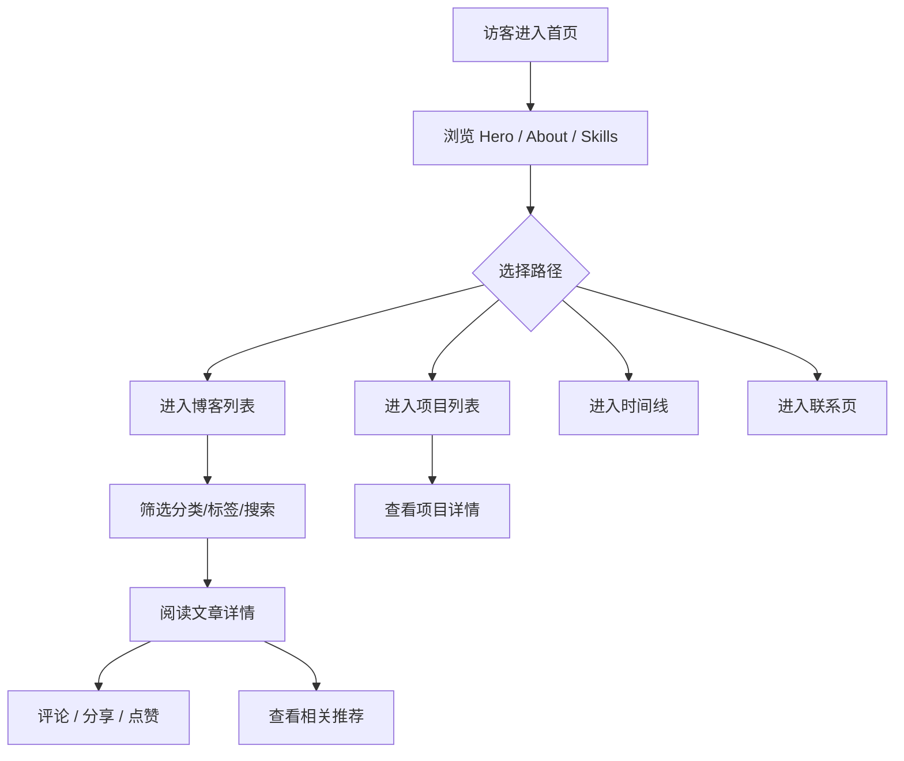
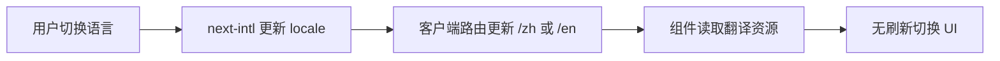

# speedcore个人博客 - 产品需求文档（PRD）

## 1. 产品概述

speedcore（Su He）个人技术博客 + 项目展示网站，定位为长期维护、可持续迭代、可直接部署上线的生产级个人站点。参考 OpenAI / Apple / Vercel 官网，主打现代、极简、科技感设计语言，支持中英文国际化与深浅色模式。

- 目标用户：技术社区读者、招聘方、合作方、个人品牌受众
- 核心价值：以最低维护成本（仅写 Markdown）持续输出内容，同时展示项目、经历、技能，构建可扩展的个人数字资产平台
- 设计基调：OpenAI 风格 — 黑白灰配色、大量留白、流畅动画、统一设计语言

## 2. 核心功能

### 2.1 用户角色

| 角色 | 访问方式 | 核心权限 |
|------|----------|----------|
| 访客 | 直接访问 | 浏览全部公开内容、搜索、评论（Giscus）、订阅 RSS |
| 站长（speedcore） | 本地 / Git | 新增 Markdown 文章、上传图片资源、配置站点信息 |

### 2.2 功能模块

1. **首页（Home）**：Hero、About Me、Skills、Latest Projects、Latest Articles、Internship Experience、Awards、Interests、GitHub Contribution、Tech Stack、Footer
2. **博客系统（Blog）**：列表页、文章详情、分类页、标签页、归档页、搜索页、404、RSS、Sitemap
3. **项目展示（Projects）**：列表页、详情页、分类、标签、时间线
4. **时间线（Timeline）**：学习经历、比赛、实习、获奖、项目
5. **联系页（Contact）**：GitHub、邮箱、微信二维码、联系表单
6. **国际化（i18n）**：中文 / English，切换无需刷新
7. **主题切换**：Dark / Light，跟随系统
8. **音乐播放器**：底部悬浮、播放列表、隐藏/暂停/继续
9. **SEO**：Open Graph、Twitter Card、JSON-LD、RSS、Sitemap、robots.txt
10. **部署**：阿里云 Linux（Docker + Nginx + PM2），兼容 Vercel / Cloudflare Pages

### 2.3 页面详情

| 页面 | 模块 | 功能描述 |
|------|------|----------|
| 首页 | Hero | 姓名、英文、介绍、四个按钮（About/Blog/GitHub/Contact）、背景图上传、动态模糊、视差、滚动渐变 |
| 首页 | About Me | 头像、Logo、中英文简介、教育经历、专业（数据科学与大数据技术）、Markdown 支持 |
| 首页 | Skills | 11 项技能卡片（Python/Java/Spring Boot/Unity/HTML/CSS/JavaScript/Vue/AI Agent/Git/Linux），分类展示、Hover/进入动画，配置驱动可扩展 |
| 首页 | Latest Projects | 展示最近项目，点击进入详情 |
| 首页 | Latest Articles | 展示最近文章，点击进入详情 |
| 首页 | Internship Experience | 实习经历展示 |
| 首页 | Awards | 获奖展示 |
| 首页 | Interests | 兴趣展示 |
| 首页 | GitHub Contribution | 贡献热力图、仓库数、Star、Pinned Repo，自动获取 |
| 首页 | Tech Stack | 技术栈展示 |
| 首页 | Footer | 站点信息、社交链接、版权 |
| 博客列表 | 文章卡片 | 封面、标题、摘要、日期、阅读时间、分类、标签 |
| 博客列表 | 筛选 | 分类、标签、归档、搜索 |
| 文章详情 | 顶部 | 封面、作者、日期、阅读时间、分类、标签、阅读进度条 |
| 文章详情 | 正文 | MDX、代码高亮、Mermaid、LaTeX、图片、视频、Callout、脚注、自动目录 |
| 文章详情 | 底部 | 相关推荐、上一篇/下一篇、返回顶部、Giscus 评论、分享按钮、点赞 |
| 项目列表 | 卡片 | 封面、标题、描述、标签、GitHub/Demo 链接 |
| 项目详情 | 正文 | Markdown、图片、视频、GitHub、Demo、时间线 |
| 时间线 | 时间轴 | 学习/比赛/实习/获奖/项目，支持无限新增 |
| 联系页 | 信息卡 | GitHub、邮箱（复制按钮）、微信二维码弹窗、联系表单 |
| 搜索 | 全站搜索 | 文章、项目、标签、分类、标题、全文，Fuse.js 驱动 |
| 404 | 友好提示 | 返回首页按钮、动画 |

## 3. 核心流程

### 3.1 内容生产流程

站长仅需在 `content/posts/` 或 `content/projects/` 新建 Markdown/MDX 文件，frontmatter 填写元数据，系统自动生成分类、标签、目录、RSS、归档、搜索索引，无需修改任何代码。

### 3.2 用户浏览流程

### 3.3 国际化流程

## 4. 用户界面设计

### 4.1 设计风格

- **主色调**：黑白灰（`#000` / `#fff` / `#f7f7f8` / `#e5e5e5` / `#6e6e80`），强调色仅用极少量品牌灰
- **按钮风格**：圆角（rounded-full / rounded-lg），主要按钮黑底白字，次要按钮描边，Hover 微动效
- **字体**：标题使用 Geist Sans（OpenAI 同源风格），正文 Geist Sans，代码 Geist Mono；中文使用系统等宽中文字体回退
- **布局**：顶部固定导航 + 内容区 + 底部播放器/页脚，卡片式与留白结合，桌面优先响应式
- **图标**：Lucide React 线性图标，统一描边
- **动画**：Framer Motion 全覆盖，尊重 `prefers-reduced-motion`

### 4.2 页面设计概览

| 页面 | 模块 | UI 元素 |
|------|------|---------|
| 首页 | Hero | 全屏视差背景、模糊遮罩、大字标题、渐显按钮、鼠标跟随光晕 |
| 首页 | About Me | 左头像右简介，圆形头像，技能徽章 |
| 首页 | Skills | 网格卡片，Hover 上浮 + 边框高亮，分类标签 |
| 首页 | GitHub Contribution | 热力图网格，数字滚动统计 |
| 博客列表 | 文章卡片 | 封面图、标题、摘要、元信息条、Hover 阴影 |
| 文章详情 | 正文 | 左侧目录、右侧文章、顶部进度条、代码块复制 |
| 项目详情 | 时间线 | 竖向时间轴节点 |
| 联系页 | 二维码弹窗 | 居中弹窗、模糊背景、关闭按钮 |

### 4.3 响应式

- 桌面优先（≥1280px）：多列布局、视差、大字标题
- 平板（768-1279px）：两列卡片、导航折叠为汉堡
- 手机（<768px）：单列、堆叠式 Hero、隐藏部分装饰、触摸优化
- 超宽屏（≥1920px）：内容区最大宽度 1400px 居中，两侧留白

### 4.4 加载与骨架

- OpenAI 风格 Loading：Logo 渐变动画
- 页面切换 Skeleton 骨架屏
- 图片模糊懒加载

## 5. 非功能需求

- **性能**：Lighthouse Performance ≥95，CLS ≈ 0，使用 next/image、字体优化、代码分割
- **SEO**：Lighthouse SEO ≥95，动态 Metadata、OG、Twitter Card、JSON-LD、RSS、Sitemap
- **可访问性**：Lighthouse Accessibility ≥95，语义化 HTML、ARIA、键盘导航
- **可维护性**：TypeScript 严格模式、无 any、组件职责单一、目录清晰、注释规范
- **可扩展性**：配置驱动（content、config、i18n），未来可无痛增加 AI Chat、留言板、Newsletter 等
