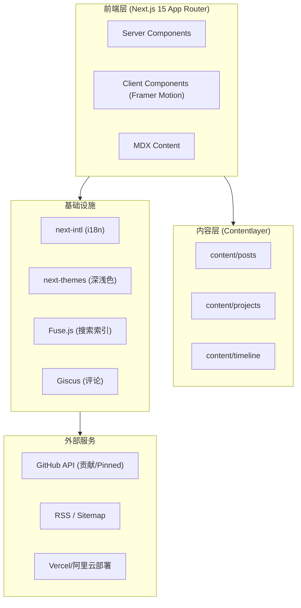

# speedcore个人博客 - 技术架构文档

## 1. 架构设计



## 2. 技术说明

- **前端框架**：Next.js 15（App Router）+ React 19 + TypeScript 5（strict）
- **样式**：Tailwind CSS 3 + CSS Variables（设计 tokens）
- **UI 组件**：Shadcn/ui（按需引入）
- **动画**：Framer Motion（页面切换、Scroll Reveal、Parallax、Hover、Blob、Mouse Follow、Skeleton）
- **内容**：Contentlayer2 + MDX + rehype/remark 插件链
- **代码高亮**：Shiki（rehype-pretty-code）
- **数学公式**：rehype-katex + remark-math
- **Mermaid**：rehype-mermaid
- **国际化**：next-intl（zh / en，App Router 集成）
- **主题**：next-themes
- **搜索**：Fuse.js（构建时生成索引）
- **评论**：Giscus
- **SEO**：next-sitemap、动态 Metadata、JSON-LD
- **工具链**：pnpm、ESLint、Prettier、Husky、lint-staged、commitlint
- **部署**：Docker + Nginx + PM2（阿里云 Linux），兼容 Vercel / Cloudflare Pages

## 3. 路由定义

| 路由 | 用途 |
|------|------|
| `/` | 重定向到 `/zh` 或 `/en`（基于浏览器语言） |
| `/[locale]` | 首页（Hero/About/Skills/Projects/Articles/...） |
| `/[locale]/blog` | 博客列表页 |
| `/[locale]/blog/[slug]` | 文章详情 |
| `/[locale]/blog/category/[category]` | 分类页 |
| `/[locale]/blog/tag/[tag]` | 标签页 |
| `/[locale]/blog/archive` | 归档页 |
| `/[locale]/search` | 搜索页 |
| `/[locale]/projects` | 项目列表 |
| `/[locale]/projects/[slug]` | 项目详情 |
| `/[locale]/timeline` | 时间线 |
| `/[locale]/contact` | 联系页 |
| `/rss.xml` | RSS |
| `/sitemap.xml` | Sitemap |
| `/robots.txt` | robots |
| `/*` | 404 |

## 4. 目录结构

```
blog/
├── app/
│   ├── [locale]/
│   │   ├── layout.tsx
│   │   ├── page.tsx                    # 首页
│   │   ├── blog/
│   │   │   ├── page.tsx
│   │   │   ├── [slug]/page.tsx
│   │   │   ├── category/[category]/page.tsx
│   │   │   ├── tag/[tag]/page.tsx
│   │   │   └── archive/page.tsx
│   │   ├── projects/
│   │   │   ├── page.tsx
│   │   │   └── [slug]/page.tsx
│   │   ├── timeline/page.tsx
│   │   ├── contact/page.tsx
│   │   └── search/page.tsx
│   ├── api/
│   │   ├── github/route.ts             # GitHub 代理
│   │   └── search/route.ts             # 搜索索引
│   ├── rss.xml/route.ts
│   ├── sitemap.xml/route.ts
│   ├── robots.ts
│   ├── not-found.tsx
│   └── globals.css
├── components/
│   ├── ui/                             # Shadcn 基础组件
│   ├── layout/                         # Header/Footer/Container
│   ├── home/                           # 首页各 Section
│   ├── blog/                           # 博客相关组件
│   ├── projects/                       # 项目相关组件
│   ├── timeline/                       # 时间线组件
│   ├── contact/                        # 联系页组件
│   ├── common/                         # 通用组件
│   └── motion/                         # 动画封装
├── content/
│   ├── posts/                          # 博客 MDX
│   └── projects/                       # 项目 MDX
├── config/
│   ├── site.ts                         # 站点配置
│   ├── skills.ts                       # 技能配置
│   ├── timeline.ts                     # 时间线配置
│   ├── nav.ts                          # 导航配置
│   └── seo.ts                          # SEO 配置
├── hooks/                              # 自定义 Hooks
├── lib/                                # 工具函数
├── i18n/
│   ├── locale.ts
│   ├── messages/
│   │   ├── zh.json
│   │   └── en.json
│   └── request.ts
├── public/
│   ├── images/
│   ├── avatar/
│   ├── logo/
│   └── music/
├── styles/
├── types/
├── contentlayer.config.ts
├── next.config.mjs
├── tailwind.config.ts
├── tsconfig.json
├── Dockerfile
├── docker-compose.yml
├── nginx.conf
├── ecosystem.config.js                 # PM2
└── .env.example
```

## 5. 数据模型

### 5.1 文章 Frontmatter

```typescript
interface PostFrontmatter {
  title: string;
  description: string;
  date: string;            // ISO
  updated?: string;
  category: 'AI Agent' | 'Unity' | 'Java' | '算法' | '随笔';
  tags: string[];
  cover?: string;
  author?: string;
  draft?: boolean;
  pinned?: boolean;
}
```

### 5.2 项目 Frontmatter

```typescript
interface ProjectFrontmatter {
  title: string;
  description: string;
  date: string;
  category: string;
  tags: string[];
  cover?: string;
  github?: string;
  demo?: string;
  video?: string;
  pinned?: boolean;
}
```

### 5.3 配置驱动模型

```typescript
// config/skills.ts
interface Skill {
  name: string;
  icon: string;            // SVG key
  category: 'language' | 'framework' | 'tool' | 'ai';
  level?: number;          // 0-100
  color?: string;
}

// config/timeline.ts
interface TimelineItem {
  date: string;
  title: string;
  description: string;
  type: 'study' | 'contest' | 'internship' | 'award' | 'project';
  link?: string;
}
```

## 6. 关键技术决策

### 6.1 内容策略

- 使用 Contentlayer2 在构建时将 MDX 编译为类型化 JSON，零运行时开销
- 新增文章仅需在 `content/posts/` 新建 `.mdx` 文件，自动出现在列表、分类、标签、归档、搜索、RSS、Sitemap
- 图片放 `public/images/posts/{slug}/`，使用 next/image 自动优化

### 6.2 国际化策略

- next-intl App Router 模式，`[locale]` 段
- 文章默认中文，frontmatter 可声明 `lang` 字段，详情页提供语言切换
- UI 文案全部走 `i18n/messages/{zh,en}.json`

### 6.3 搜索策略

- 构建时由 Contentlayer 生成 `search-index.json`，包含 title/description/tags/category/content 摘要
- 客户端 Fuse.js 加载索引，支持模糊匹配，键盘快捷键 `Cmd/Ctrl + K` 唤起

### 6.4 性能策略

- Server Components 优先，仅在交互处加 `'use client'`
- Framer Motion 按需引入
- 字体 `next/font` 自托管
- 图片 next/image + blurDataURL
- 动画尊重 `prefers-reduced-motion`

### 6.5 部署策略

- **阿里云 Linux**：Dockerfile 多阶段构建 → Nginx 反代静态/Node → PM2 守护
- **Vercel**：零配置部署
- **Cloudflare Pages**：兼容 Next.js on Pages

## 7. 部署方案

### 7.1 Dockerfile（多阶段）

```dockerfile
FROM node:20-alpine AS deps
WORKDIR /app
RUN corepack enable
COPY package.json pnpm-lock.yaml ./
RUN pnpm install --frozen-lockfile

FROM node:20-alpine AS builder
WORKDIR /app
RUN corepack enable
COPY --from=deps /app/node_modules ./node_modules
COPY . .
RUN pnpm build

FROM node:20-alpine AS runner
WORKDIR /app
ENV NODE_ENV=production
COPY --from=builder /app/.next/standalone ./
COPY --from=builder /app/.next/static ./.next/static
COPY --from=builder /app/public ./public
EXPOSE 3000
CMD ["node", "server.js"]
```

### 7.2 docker-compose.yml

```yaml
version: '3.9'
services:
  blog:
    build: .
    container_name: suhe-blog
    restart: always
    ports:
      - "3000:3000"
    env_file:
      - .env
```

### 7.3 Nginx 反代要点

- gzip / brotli 压缩
- 静态资源 Cache-Control: immutable
- HTTPS（Let's Encrypt）
- 反代到 127.0.0.1:3000

### 7.4 PM2 备选

```js
// ecosystem.config.js
module.exports = {
  apps: [{
    name: 'suhe-blog',
    script: 'node_modules/.bin/next',
    args: 'start -p 3000',
    instances: 1,
    autorestart: true,
    max_memory_restart: '512M',
  }]
}
```

## 8. 可扩展性预留

- `config/` 目录驱动所有可配置内容，新增技能/时间线/导航无需改核心代码
- `app/api/` 预留接口层，未来可接 AI Chat / AI Agent / Newsletter
- 组件按域划分（home/blog/projects/timeline/contact），新增页面域即可
- i18n messages 结构扁平，新增语言仅需新增 JSON 文件
