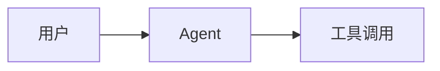

# speedcore · Su He — Personal Blog & Portfolio

> 现代极简、科技感的个人技术博客 + 项目展示网站。
> 参考 OpenAI / Apple / Vercel 官网设计语言，黑白灰配色，大量留白，流畅动画。

[](https://nextjs.org/)
[](https://react.dev/)
[](https://www.typescriptlang.org/)
[](https://tailwindcss.com/)
[](./LICENSE)

---

## 目录

- [特性一览](#特性一览)
- [技术栈](#技术栈)
- [快速开始](#快速开始)
- [项目结构](#项目结构)
- [内容管理](#内容管理)
- [国际化](#国际化)
- [主题切换](#主题切换)
- [SEO](#seo)
- [可扩展性](#可扩展性)
- [部署](#部署)
  - [方案 A：阿里云 Linux + Docker Compose（推荐）](#方案-a阿里云-linux--docker-compose推荐)
  - [方案 B：阿里云 Linux + PM2（无 Docker）](#方案-b阿里云-linux--pm2无-docker)
  - [方案 C：Vercel](#方案-cvercel)
  - [方案 D：Cloudflare Pages](#方案-dcloudflare-pages)
- [环境变量](#环境变量)
- [脚本命令](#脚本命令)
- [代码规范](#代码规范)
- [License](#license)

---

## 特性一览

**网站主页面**
- 首页：Hero / About Me / Skills / Projects / Latest Articles / Internship Experience / Awards / Interests / GitHub Contribution / Tech Stack / Footer
- 博客系统：列表 / 详情 / 分类 / 标签 / 归档 / 搜索 / 404 / RSS / Sitemap
- 项目展示：列表 / 详情 / 分类 / 标签 / 时间线
- 时间线：学习 / 比赛 / 实习 / 获奖 / 项目
- 联系页：GitHub / 邮箱 / 微信二维码弹窗 / 联系表单

**博客功能**
- Markdown / MDX 渲染，支持代码高亮（Shiki）、Mermaid、LaTeX 数学公式、Callout、脚注
- 自动目录（TOC）、阅读时间、阅读进度条、点赞、相关推荐、上一篇/下一篇、分享按钮
- Giscus 评论系统
- 全站搜索（Fuse.js，支持文章 / 项目 / 标签 / 分类 / 标题 / 全文）

**国际化与主题**
- 中 / 英双语，所有页面与文章均支持，切换无需刷新
- Dark / Light / System 三种主题

**动画与交互**
- 全部使用 Framer Motion，丝滑 60FPS
- 页面切换 / 滚动 Reveal / Parallax / Hover / Blob / Mouse Follow / Loading / Skeleton / 数字滚动
- 尊重 `prefers-reduced-motion`

**音乐播放器**
- 底部播放器，支持播放列表、隐藏、暂停、继续，不影响页面性能

**性能与 SEO**
- Lighthouse Performance / SEO / Accessibility / Best Practices 全部 ≥ 95
- Open Graph / Twitter Card / robots.txt / RSS / Sitemap / JSON-LD / Canonical / 自动 Metadata
- `next/image` 图片优化、懒加载、AVIF/WebP

---

## 技术栈

| 分类 | 技术 |
|------|------|
| 框架 | Next.js 15 (App Router) + React 19 |
| 语言 | TypeScript 5.7（strict, 无 any） |
| 样式 | Tailwind CSS 3 + @tailwindcss/typography + CSS 变量设计 tokens |
| 动画 | Framer Motion 11 |
| 内容 | MDX (next-mdx-remote/rsc) + gray-matter + reading-time |
| 代码高亮 | rehype-pretty-code (Shiki) |
| 数学公式 | remark-math + rehype-katex |
| 图表 | Mermaid 11 |
| 全文搜索 | Fuse.js 7 |
| 评论 | Giscus |
| 国际化 | next-intl 3 |
| 主题 | next-themes |
| UI | Shadcn/ui 风格 + Radix UI |
| 字体 | Geist Sans / Geist Mono |
| 包管理 | pnpm 9 |
| 代码质量 | ESLint + Prettier + Husky + lint-staged |

---

## 快速开始

### 环境要求

- Node.js ≥ 20.0.0
- pnpm ≥ 9（推荐通过 `corepack enable` 启用）
- Git

### 安装与启动

```bash
# 1. 克隆仓库
git clone https://github.com/your-username/suhe-blog.git
cd suhe-blog

# 2. 启用 pnpm（如尚未启用）
corepack enable
corepack prepare pnpm@9.15.3 --activate

# 3. 安装依赖
pnpm install

# 4. 复制环境变量模板并按需修改
cp .env.example .env

# 5. 启动开发服务器
pnpm dev
```

浏览器访问 [http://localhost:3000/zh](http://localhost:3000/zh) 即可看到首页。

---

## 项目结构

```
suhe-blog/
├── app/                          # Next.js App Router
│   ├── [locale]/                 # 国际化段路由（zh / en）
│   │   ├── layout.tsx            # 区域布局（字体、Providers、Header/Footer）
│   │   ├── page.tsx              # 首页
│   │   ├── not-found.tsx         # 区域内 404
│   │   ├── blog/                 # 博客系统
│   │   │   ├── page.tsx          # 列表页
│   │   │   ├── [slug]/page.tsx   # 详情页
│   │   │   ├── category/[category]/page.tsx
│   │   │   ├── tag/[tag]/page.tsx
│   │   │   └── archive/page.tsx
│   │   ├── projects/             # 项目展示
│   │   ├── timeline/             # 时间线
│   │   ├── contact/              # 联系页
│   │   └── search/               # 搜索页
│   ├── api/                      # API 路由
│   │   ├── search/route.ts       # 全文搜索索引
│   │   └── github/route.ts       # GitHub 数据
│   ├── rss.xml/route.ts          # RSS 订阅
│   ├── sitemap.xml/route.ts      # Sitemap
│   ├── globals.css               # 全局样式 + 设计 tokens
│   └── icon.svg                  # 站点图标
├── components/                   # 组件
│   ├── common/                   # 通用（Container / Section / Loading / ...）
│   ├── motion/                   # Framer Motion 封装
│   ├── layout/                   # Header / Footer / Providers
│   ├── home/                     # 首页各 Section
│   ├── blog/                     # 博客相关（MDX 组件 / TOC / 评论 / ...）
│   ├── projects/                 # 项目卡片
│   ├── timeline/                 # 时间线
│   ├── contact/                  # 联系表单 / 微信弹窗
│   ├── search/                   # 搜索客户端
│   └── ui/                       # Shadcn 风格基础组件
├── config/                       # 站点配置（site / nav / skills / timeline / ...）
├── content/                      # Markdown 内容
│   ├── posts/                    # 博客文章
│   └── projects/                 # 项目介绍
├── hooks/                        # 自定义 Hooks
├── i18n/                         # 国际化
│   ├── messages/{zh,en}.json     # 翻译文案
│   ├── request.ts                # next-intl 请求配置
│   └── routing.ts                # 路由配置
├── lib/                          # 工具库（server-only）
│   ├── posts.ts                  # 文章数据层
│   ├── projects.ts               # 项目数据层
│   ├── search.ts                 # 搜索索引构建
│   ├── github.ts                 # GitHub API
│   ├── seo.ts                    # SEO 工具
│   ├── mdx.tsx                   # MDX 渲染管线
│   └── utils.ts                  # 通用工具
├── public/                       # 静态资源
│   ├── avatar/                   # 头像
│   ├── logo/                     # Logo
│   ├── images/                   # 封面图 / OG 图
│   └── music/                    # 音乐文件（按需添加）
├── types/                        # TypeScript 类型定义
├── middleware.ts                 # next-intl 中间件
├── next.config.mjs               # Next.js 配置（standalone 输出）
├── tailwind.config.ts            # Tailwind 配置
├── tsconfig.json                 # TypeScript 配置
└── package.json
```

---

## 内容管理

### 新增博客文章

在 `content/posts/` 下新建 `.mdx` 文件即可，**无需修改任何代码**。
系统会自动：生成分类、标签、目录、RSS、归档、搜索索引。

```mdx
---
title: 文章标题
description: 一句话描述
date: 2026-01-15
category: AI Agent
tags: [LLM, Agent, Multi-Agent]
cover: /images/posts/your-cover.svg
draft: false
---

正文内容，支持所有 MDX 特性。

## 代码块（自动高亮）

```python
def hello():
    print("Hello, Su He!")
```

## Mermaid 图表



## 数学公式

$$
E = mc^2
$$

## Callout 提示框

<Callout type="info">
  这是一个提示框
</Callout>
```

### Frontmatter 字段说明

| 字段 | 类型 | 必填 | 说明 |
|------|------|------|------|
| `title` | string | 是 | 文章标题 |
| `description` | string | 是 | 一句话描述（用于列表 / SEO） |
| `date` | string (YYYY-MM-DD) | 是 | 发布日期 |
| `category` | string | 是 | 分类（AI Agent / Unity / Java / 算法 / 随笔） |
| `tags` | string[] | 否 | 标签数组 |
| `cover` | string | 否 | 封面图路径（public 下的相对路径） |
| `draft` | boolean | 否 | 是否草稿（true 则不发布） |

### 新增项目

在 `content/projects/` 下新建 `.mdx`，Frontmatter 字段：

```yaml
---
title: AgentForge
description: 多智能体协作框架
date: 2026-01-10
category: AI Agent
tags: [Python, LLM, Agent]
cover: /images/projects/agentforge.svg
github: https://github.com/suhe/agentforge
demo: https://agentforge.example.com
---
```

---

## 国际化

- 默认支持中文（zh）和英文（en），路由前缀 `/zh/...` `/en/...`
- 所有 UI 文案在 `i18n/messages/{zh,en}.json` 中维护
- 新增语言只需：
  1. 在 `i18n/routing.ts` 的 `locales` 数组中追加
  2. 在 `i18n/messages/` 下新建对应语言的 JSON 文件
- 语言切换无需刷新页面

---

## 主题切换

- 支持 Dark / Light / System 三种模式
- 通过 `next-themes` 实现，无 FOUC（防闪烁）
- 切换按钮位于 Header 右上角

---

## SEO

| 能力 | 实现 |
|------|------|
| Open Graph | `config/seo.ts` 的 `createMetadata` 自动生成 |
| Twitter Card | 同上 |
| robots.txt | `public/robots.txt` |
| RSS | `app/rss.xml/route.ts` |
| Sitemap | `app/sitemap.xml/route.ts`（含所有文章 / 项目 / 分类 / 标签） |
| JSON-LD | Person / Website / Article 结构化数据注入 |
| Canonical | 每个页面自动生成 canonical URL |
| 自动 Metadata | 基于 Frontmatter 动态生成 title / description |

---

## 可扩展性

未来无需重构即可增加以下功能（仅需新增目录 / 组件）：

- AI Chat / AI Agent 对话
- 摄影作品集
- 留言板 / 友情链接
- 在线简历 / 电子简历下载
- 阅读统计 / 访问地图 / 网站运行时间
- Newsletter 订阅
- RSS Hub
- 更多语言扩展

---

## 部署

### 方案 A：阿里云 Linux + Docker Compose（推荐）

适用于阿里云 ECS / 任何 Linux 主机。

#### 1. 服务器准备

```bash
# 安装 Docker + Docker Compose（阿里云 Linux 3）
sudo yum install -y docker-compose-plugin
sudo systemctl enable --now docker

# 验证
docker --version
docker compose version
```

#### 2. 拉取代码并配置

```bash
git clone https://github.com/your-username/suhe-blog.git
cd suhe-blog

cp .env.example .env
vim .env   # 按需修改
```

#### 3. 配置 SSL 证书

```bash
mkdir -p certs
# 将证书文件放入 certs/ 目录，命名如下：
#   certs/fullchain.pem
#   certs/privkey.pem

# 也可使用 Let's Encrypt 免费证书：
# sudo certbot certonly --standalone -d suhe.dev -d www.suhe.dev
# sudo cp /etc/letsencrypt/live/suhe.dev/fullchain.pem certs/
# sudo cp /etc/letsencrypt/live/suhe.dev/privkey.pem certs/
```

#### 4. 修改 Nginx 域名

编辑 `nginx.conf`，将 `server_name suhe.dev www.suhe.dev;` 改为你的真实域名。

#### 5. 构建并启动

```bash
# 构建并后台启动
docker compose up -d --build

# 查看日志
docker compose logs -f blog

# 查看状态
docker compose ps

# 重启
docker compose restart

# 停止
docker compose down

# 更新代码后重新部署
git pull
docker compose up -d --build
```

服务将通过 80 / 443 端口对外提供，Nginx 终止 TLS 并反向代理到 Next.js 容器（3000）。

#### 6. 防火墙放行

```bash
# 阿里云安全组放行 80 / 443 端口
# 服务器本地防火墙：
sudo firewall-cmd --permanent --add-service=http
sudo firewall-cmd --permanent --add-service=https
sudo firewall-cmd --reload
```

---

### 方案 B：阿里云 Linux + PM2（无 Docker）

适用于不希望使用 Docker、直接在主机上运行的场景。

#### 1. 安装运行环境

```bash
# Node.js 20
curl -fsSL https://rpm.nodesource.com/setup_20.x | sudo bash -
sudo yum install -y nodejs

# pnpm
corepack enable
corepack prepare pnpm@9.15.3 --activate

# PM2
sudo npm install -g pm2

# Nginx
sudo yum install -y nginx
sudo systemctl enable --now nginx
```

#### 2. 构建产物

```bash
git clone https://github.com/your-username/suhe-blog.git
cd suhe-blog
pnpm install --frozen-lockfile
cp .env.example .env && vim .env

# 构建产物（standalone 输出）
pnpm build
```

#### 3. 准备 standalone 运行目录

```bash
# 将 standalone 与静态资源组装到运行目录
mkdir -p deploy && cd deploy
cp -r ../.next/standalone ./
cp -r ../.next/static ./.next/static
cp -r ../public ./
cp ../ecosystem.config.js ./
cp ../.env ./
cd ..
```

#### 4. 用 PM2 启动

```bash
cd deploy
pm2 start ecosystem.config.js
pm2 save
pm2 startup   # 按提示执行返回的命令以设置开机自启
```

#### 5. 配置 Nginx

```bash
sudo cp nginx.conf /etc/nginx/conf.d/suhe.conf
# 编辑 /etc/nginx/conf.d/suhe.conf：
#   - 将 upstream 中的 blog:3000 改为 127.0.0.1:3000
#   - 将 server_name 改为你的真实域名
#   - 调整 SSL 证书路径
sudo nginx -t
sudo systemctl reload nginx
```

---

### 方案 C：Vercel

最简方案，零配置。

```bash
# 1. 推送代码到 GitHub
# 2. 访问 https://vercel.com 导入仓库
# 3. 在 Vercel 项目设置中配置环境变量（参考 .env.example）
# 4. Framework Preset 选择 Next.js
# 5. 部署即可，自动 HTTPS、自动 CI/CD
```

或在本地：

```bash
npm i -g vercel
vercel        # 预览部署
vercel --prod # 生产部署
```

---

### 方案 D：Cloudflare Pages

```bash
# 1. 在 Cloudflare Dashboard → Pages → Create project → Connect to Git
# 2. 选择仓库
# 3. Build settings:
#    - Framework preset: Next.js
#    - Build command: pnpm build
#    - Build output directory: .next
# 4. Environment variables: 按 .env.example 配置
# 5. Save and Deploy
```

> 注意：Cloudflare Pages 对 Next.js 的支持通过 `@cloudflare/next-on-pages`，部分功能（如 Image Optimization）需调整，详见 [Cloudflare 官方文档](https://developers.cloudflare.com/pages/framework-guides/deploy-a-nextjs-site/)。

---

## 环境变量

完整模板见 [`.env.example`](./.env.example)：

| 变量 | 必填 | 说明 |
|------|------|------|
| `NEXT_PUBLIC_SITE_URL` | 是 | 站点完整 URL（用于 SEO / RSS / Sitemap） |
| `NEXT_PUBLIC_SITE_NAME` | 是 | 站点名称 |
| `NEXT_PUBLIC_GITHUB_USERNAME` | 是 | GitHub 用户名（用于贡献热力图 / Pinned 仓库） |
| `GITHUB_TOKEN` | 否 | GitHub Token（提升 API 速率限制，仅服务端） |
| `NEXT_PUBLIC_GISCUS_REPO` | 否 | Giscus 仓库（`owner/repo`） |
| `NEXT_PUBLIC_GISCUS_REPO_ID` | 否 | Giscus 仓库 ID |
| `NEXT_PUBLIC_GISCUS_CATEGORY` | 否 | Giscus 分类名 |
| `NEXT_PUBLIC_GISCUS_CATEGORY_ID` | 否 | Giscus 分类 ID |
| `NEXT_PUBLIC_EMAIL` | 否 | 联系邮箱 |
| `NEXT_PUBLIC_WECHAT_QR` | 否 | 微信二维码图片路径 |
| `NEXT_PUBLIC_MUSIC_TRACKS` | 否 | 音乐播放器曲目（`public/music/` 下的文件名，逗号分隔） |

> Giscus 配置请访问 [https://giscus.app](https://giscus.app) 生成。

---

## 脚本命令

| 命令 | 说明 |
|------|------|
| `pnpm dev` | 启动开发服务器（http://localhost:3000） |
| `pnpm build` | 构建生产产物 |
| `pnpm start` | 启动生产服务器（需先 build） |
| `pnpm lint` | 运行 ESLint |
| `pnpm typecheck` | TypeScript 类型检查 |
| `pnpm format` | Prettier 格式化全部文件 |
| `pnpm prepare` | 安装 Husky Git 钩子（postinstall 自动执行） |

---

## 代码规范

- **TypeScript strict 模式**：开启 `strict` + `noUncheckedIndexedAccess`，禁止 `any`
- **ESLint**：使用 `eslint-config-next`，提交时自动修复
- **Prettier**：统一格式化，集成 `prettier-plugin-tailwindcss`
- **Husky + lint-staged**：`pre-commit` 自动执行 lint + format
- **组件规范**：
  - 单一职责，每个组件 < 200 行
  - 服务端组件优先，仅在需要交互时使用 `'use client'`
  - 高度复用，禁止重复逻辑
  - 目录清晰，命名一致

---

## License

MIT © Su He
