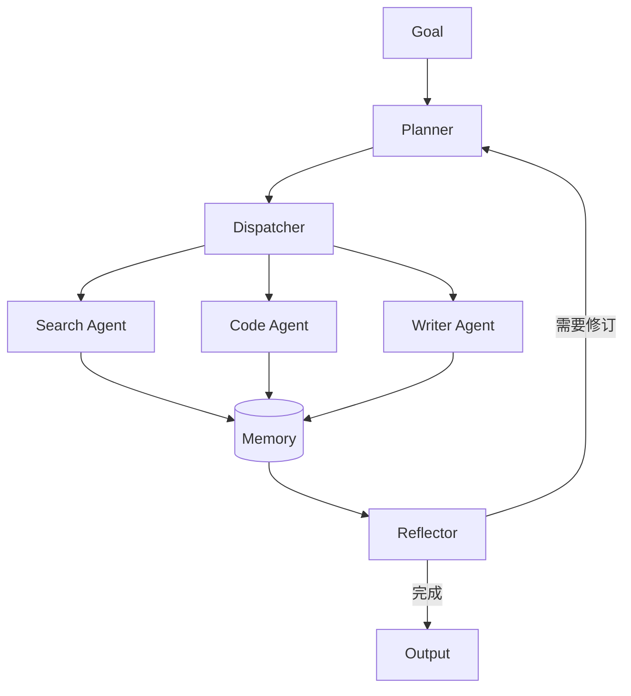

## 项目简介

AgentForge 是我做独立开发时抽出来的多智能体编排框架。核心目标：**用 200 行核心代码**跑通「分解 → 分发 → 执行 → 反思」闭环。

## 特性

- 职责单一的 Worker Agent，热插拔
- 基于 Redis / 文件的可插拔 Memory Store
- 工具调用统一接口，自动 JSON Schema 生成
- 失败自动重规划

## 架构



## 使用示例

```python
from agentforge import Orchestrator, Memory, Agent

forge = Orchestrator(
    agents={
        "search": Agent("search", tools=[web_search]),
        "code":   Agent("code",   tools=[run_python]),
        "writer": Agent("writer", tools=[]),
    },
    memory=Memory(),
)

print(forge.run("写一篇关于多智能体的科普短文"))
```

## 成果

- 内部项目接入后任务完成率从 62% → 89%
- GitHub 收获 200+ Star
- 已用于个人知识库自动整理
